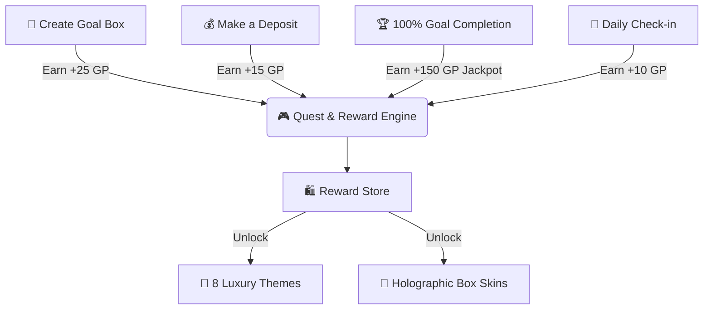

<!-- Header Capsule Banner with Wave Animation -->
<p align="center">
  
</p>

<!-- App Icon Showcase -->
<p align="center">
  
</p>

<!-- Dynamic Multi-line Typing Animation -->
<p align="center">
  <a href="https://github.com/gencode3939/Gen-Box">
    
  </a>
</p>

<!-- Shield Badges -->
<p align="center">
  <a href="https://android.com"></a>
  <a href="https://kotlinlang.org"></a>
  <a href="https://developer.android.com/jetpack/compose"></a>
  <a href="https://developer.android.com/training/data-storage/room"></a>
  <a href="https://github.com/gencode3939/Gen-Box"></a>
</p>

---

## 📖 What is Gen Box?

<p align="center">
  <b>Gen Box</b> is a modern, privacy-first Android application that transforms personal savings into an intuitive, motivating, and gamified experience. 
  <br/><br/>
  Operating <b>100% locally on your device</b> with zero accounts, zero cloud dependencies, and zero tracking — Gen Box turns financial discipline into an engaging journey with real-time deposit rewards, dynamic quests, 8 luxury aesthetic themes, and velocity-based goal pacing.
</p>

---

## 🌟 Interactive Features at a Glance

<div align="center">



</div>

---

## ✨ Key Superpowers

### 🎮 1. Gamified Quest & Instant Reward Engine
- 💎 **Instant Action Rewards**:
  - **New Vault Setup**: `+25 Gen Points` 🌟
  - **Every Deposit Contribution**: `+15 Gen Points` 💰
  - **100% Goal Completion Jackpot**: `+150 Gen Points` 🏆
  - **Daily First-Open Check-in**: `+10 Gen Points` 📅
- 📜 **Dynamic Quest Loops**: Daily check-ins, deposit tasks, streak pacing, and permanent milestones (*7-Day Rhythm Legend, Grand Savings Master*).
- 🛍️ **Cosmetic Unlock Store**: Redeem earned Gen Points to unlock luxury themes and holographic box materials permanently.

### 🎨 2. 8 Ultra-Luxury Visual Themes
Carefully crafted high-contrast Material Design 3 palettes for every aesthetic:
- 🌌 **Emerald Deep Night (Classic)** — Deep obsidian with electric emerald neon accents.
- ⚡ **Cyberpunk Neon & Violet** — High-voltage cyan, hot pink, and cosmic space violet.
- 🔮 **Midnight Amethyst** — Luxurious lavender radiance on deep midnight canvas.
- 🌅 **Sunset & Amber** — Warm terracotta, copper, and golden sunset tones.
- ❄️ **Nordic Glacier** — Pure arctic cyan, iceberg blue, and deep sapphire.
- 🌸 **Rose Gold & Champagne** — Sophisticated rose quartz and champagne luxury.
- 🖤 **Titanium Stealth (OLED)** — Pure deep OLED black with titanium silver crispness.
- 🌲 **Forest Pine & Sage** — Peaceful woodland emerald, sage, and warm earth tones.

### 🍱 3. Holographic Box Visual Shaders
- 🪟 **Minimal Glass** — Frosted translucent glass morphism with soft rim lighting.
- 💡 **Neon Glow** — Pulsing cybernetic borders and electric neon glow.
- 🪵 **Wooden Vault** — Organic timber texture providing a grounded, tangible vault feel.
- ⚡ **Cyber Tech** — High-tech circuit traces and glowing futuristic grids.
- 👑 **Golden Armor** — Royal polished gold metallic sheen and luxury reflections.

### 🎯 4. 30+ Categorized Custom Goal Icons
- 💳 **Finance & Wealth**: Vault Box, Piggy Bank, Investment Fund, Bank Deposit, Diamonds, Stock Growth, Salary, Cash Reserve.
- 🚀 **Tech & Dreams**: Moonshot Rocket, Laptop/Mac, Smartphone, Gaming Console, Camera, Sports Car, Motorcycle, World Travel.
- 🏡 **Home & Lifestyle**: Home/Villa, Real Estate, Fashion, Botany Garden, Health, Gym/Fitness, Education, Family Fund.
- 👑 **Prestige & Luxury**: Royal Crown, Emergency Shield, Honor Medal, Cosmic Stars, Wedding Celebration, Luxury Watch.

### 🔒 5. Zero-Leakage Security & Local Vault
- 📴 **100% Offline-First**: No internet permission required. Your financial records never leave your pocket.
- 🛡️ **Privacy Shield Mode**: Single-tap toggle to obscure all monetary amounts (`••••••`) in public spaces.
- 📁 **JSON Snapshots & CSV Export**: Spreadsheet-ready data exports with built-in CSV formula injection protection (CWE-1236).
- 📜 **Local Security Audit Trail**: Comprehensive timestamped log of all balance changes and backups.

---

## 🏗️ Clean Modular Architecture

```
Gen-Box/
├── app/src/main/java/com/example/
│   ├── core/
│   │   ├── database/       # Room DB (Entities, DAOs, Migrations, TypeConverters)
│   │   ├── gamification/   # Quests Engine, Points Ledger, Reward Store & Velocity
│   │   ├── localization/   # Runtime Bilingual Engine (English / Turkish)
│   │   ├── model/          # Domain Entities (Goal, Money, Transaction, RewardItem)
│   │   ├── repository/     # Repository Pattern & Local Persistence
│   │   └── utils/          # Pacing Algorithm, Currency Formatter, Security Sanitize
│   └── ui/
│       ├── components/     # Spring Physics Click, Particle Confetti, Money Ticker
│       ├── dialogs/        # Goal Form, Deposit/Withdraw, Color Picker & Backup Sheets
│       ├── screens/        # Dashboard, Goals, Quests & Store, Analytics, Settings
│       ├── theme/          # Material 3 Color Schemes (8 Custom Themes), Typography
│       ├── MainActivity.kt # Edge-to-Edge Single Activity Entrypoint
│       └── MainViewModel.kt# Unified StateFlow Reactive State Management
```

| Technology | Purpose |
| :--- | :--- |
| **Kotlin 2.0+** | Modern, expressive, and type-safe language |
| **Jetpack Compose (M3)** | Declarative, smooth, and tactile UI system |
| **Room Database (KSP)** | 100% Offline, ACID-compliant local SQLite storage |
| **StateFlow & Coroutines** | Reactive single-source-of-truth state management |
| **DataStore Preferences** | Type-safe user settings and theme persistence |
| **Edge-to-Edge API** | Immersive full-screen design respecting system insets |

---

## 🚀 Getting Started

### Prerequisites
- **Android Studio** Ladybug / Koala (2024.1+) or newer
- **JDK 17** or higher
- **Android Device / Emulator**: Android 8.0 (API 26) or above

### Quick Build & Run

```bash
# 1. Clone the repository
git clone https://github.com/gencode3939/Gen-Box.git
cd Gen-Box

# 2. Build the Debug APK
./gradlew assembleDebug

# 3. Install & launch on connected device
./gradlew installDebug
```

---

## 📦 Direct Repository Download

Explore the complete source code, inspect pull requests, and grab the latest builds:

👉 **GitHub Repository:** [https://github.com/gencode3939/Gen-Box](https://github.com/gencode3939/Gen-Box)

---

<!-- Animated Footer Wave -->
<p align="center">
  
</p>

<p align="center">
  <sub>Developed by <a href="https://github.com/gencode3939"><b>@gencode3939</b></a> • Open Source under the MIT License</sub>
</p>
