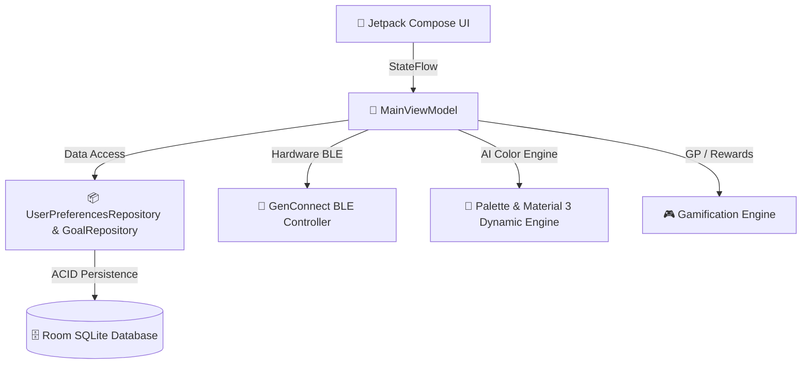

<!-- Animated Header Banner -->
<div align="center">
  

  <a href="https://github.com/gencode3939/Gen-Box">
    
  </a>
</div>

<!-- Shield Badges -->
<p align="center">
  <a href="https://android.com"></a>
  <a href="https://kotlinlang.org"></a>
  <a href="https://developer.android.com/jetpack/compose"></a>
  <a href="https://developer.android.com/training/data-storage/room"></a>
  <a href="https://bluetooth.com"></a>
  <a href="https://github.com/gencode3939/Gen-Box"></a>
</p>

---

## 🌟 Gen Box Nedir? / What is Gen Box?

<p align="center">
  <b>Gen Box</b>, finansal hedeflerinizi ve birikim alışkanlıklarınızı eğlenceli, motive edici ve tamamen <b>çevrimdışı (100% Offline-First)</b> bir oyunlaştırılmış deneyime dönüştüren yeni nesil Android uygulamasıdır.<br/><br/>
  <i>Sıfır hesap, sıfır bulut bağımlılığı ve sıfır veri takibi</i> prensibiyle çalışan Gen Box; dinamik AI renk paletleri, Bluetooth üzerinden cihazlar arası hava boşluklu (Air-Gapped) tema transferi ve akıcı Material 3 animasyonlarıyla donatılmıştır.
</p>

---

## 🚀 Son Yapılan Yenilikler & Güncellemeler (Changelog)

<div align="center">
  
</div>

### 📡 1. Gen Connect: Gerçek Bluetooth & BLE Donanım Taraması
- 🔍 **Donanım Düzeyinde BLE Arama:** Sahte/simüle cihazlar kaldırıldı. Artık `BluetoothAdapter` ve `BluetoothLeScanner` kullanılarak yakındaki ve eşleşmiş gerçek cihazlar taranır.
- 🔐 **GTP2 Güvenli Paket Protokolü:** 4-bayt Magic Header (`GTP2`), 64-bayt SHA-256 bütünlük kontrolü ve AES-256-GCM şifreleme.
- ⚡ **Ultra Turbo Mod:** 512-bayt MTU ve sıfır internet bağımlılığıyla cihazlar arası temaları saniyeler içinde paylaşın.

### 🎨 2. Dinamik Tema Uygulama & Global Renk Reaktifi
- 🌈 **Anında Renk Yansıtma:** `ThemeStudio` üzerinden üretilen veya `Gen Connect` ile alınan özel AI temaları anında tüm uygulamaya dinamik Material 3 `ColorScheme` olarak uygulanır.
- 🎛️ **Ayarlar İçi Hızlı Seçim:** Ayarlar ekranına yerleştirilen hızlı tema çipleri (Calm Blue, Warm Coral, Night Glass, Mint Focus, Neutral Paper) ile tek tıkla geçiş yapabilir, özel AI temasını sıfırlayabilirsiniz.
- 🌊 **Velvet Morphing Geçişleri:** Renkler değiştiğinde arayüz `animateColorAsState` ile yumuşak ve akıcı bir şekilde renk değiştirir.

### 🎮 3. Oyunlaştırılmış Görev & Ödül Merkezi (Gamification Engine)
- 🏆 **Gen Puanı (GP) Sistemi:** Her para yatırmada `+15 GP`, hedef oluşturmada `+25 GP`, hedefe ulaşıldığında `+150 GP` Jackpot!
- 🎖️ **Seviye ve Başarım Ağacı:** Seviye atlayarak yeni kutu stilleri, premium temalar ve özel hologram gölgelendiricileri açın.
- 🎁 **Ödül Mağazası:** Kazanılan puanları estetik temalara ve 3D kutu efektlerine dönüştürün.

### 🌌 4. Quiet Galaxy & Gen Voice Asistanı
- 🧘 **Quiet Galaxy:** Birikim yolculuğunuzda zihinsel dinginlik ve motivasyon sağlayan etkileşimli galaksi deneyimi.
- 🎙️ **Gen Voice Assistant:** Sesli komutlarla para ekleme, hedef sorgulama ve durum özeti alma yeteneği.
- 🎼 **Goal Orchestra:** Çoklu hedefleri tek bir orkestrasyon panosunda organize edin ve hızlandırılmış tasarruf rotaları oluşturun.

### 🛡️ 5. Güvenlik, Gizlilik & Temiz Kod Optimizasyonu
- 🔒 **Sıfır Bulut Bağımlılığı:** Tüm verileriniz cihazınızdaki Room SQLite veri tabanında güvenle saklanır.
- 🙈 **Gizlilik Kalkanı (Privacy Shield):** Kalabalık ortamlarda bakiyelerinizi tek tıkla maskeleme (`••••••`).
- 🧹 **Arındırılmış Arayüz:** Gereksiz debug menüleri temizlendi, sade ve güven veren modern bir **Sürüm Bilgi Kartı** eklendi.

---

## 🏗️ Mimari ve Teknoloji Yığını



| Bileşen / Component | Kullanılan Teknoloji / Technology | İşlev / Purpose |
| :--- | :--- | :--- |
| **Arayüz (UI)** | Jetpack Compose, Material Design 3 | Akıcı animasyonlar, dinamik temalama ve modern kart bileşenleri |
| **Mimari** | MVVM, Clean Architecture, Kotlin Flow | Reaktif tek yönlü veri akışı ve katmanlı temiz kod |
| **Veri Tabanı** | Room SQLite (KSP Destekli) | %100 çevrimdışı, güvenli ve şifreli yerel depolama |
| **Bluetooth / BLE** | Android Bluetooth LE Framework | Donanım tabanlı hava boşluklu (Air-Gapped) veri transferi |
| **Kriptografi** | AES-256-GCM, SHA-256 Digest | Cihazlar arası GTP2 paketlerinin tam bütünlük ve gizlilik doğrulaması |

---

## 📲 Kurulum ve Çalıştırma

### Gereksinimler
- **Android Sürümü:** Android 8.0 (API 26) veya üzeri (Android 14+ önerilir)
- **Geliştirme Ortamı:** Android Studio Koala / Ladybug (2024.1+)
- **JDK:** Java 17 veya üzeri

```bash
# 1. Projeyi klonlayın
git clone https://github.com/gencode3939/Gen-Box.git
cd Gen-Box

# 2. Debug APK'sını derleyin
./gradlew assembleDebug

# 3. Bağlı cihaza veya emülatöre yükleyin
./gradlew installDebug
```

---

<!-- Animated Footer Wave -->
<p align="center">
  
</p>

<p align="center">
  <sub>Geliştirici: <a href="https://github.com/gencode3939"><b>@gencode3939</b></a> • MIT Lisansı ile Açık Kaynak</sub>
</p>
