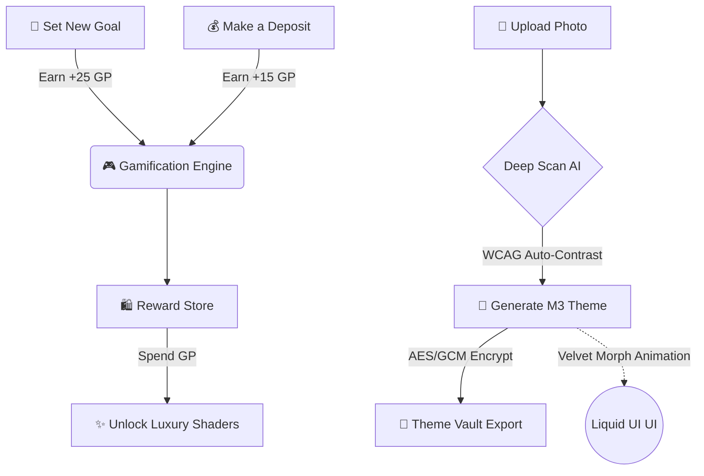

<!-- Animated Header Banner -->
<div align="center">
  

  <a href="https://github.com/gencode3939/Gen-Box">
    
  </a>
</div>

<!-- Shield Badges -->
<p align="center">
  <a href="https://android.com"></a>
  <a href="https://kotlinlang.org"></a>
  <a href="https://developer.android.com/jetpack/compose"></a>
  <a href="https://developer.android.com/training/data-storage/room"></a>
  <a href="https://github.com/gencode3939/Gen-Box"></a>
</p>

---

## 📖 What is Gen Box?

<p align="center">
  <b>Gen Box</b> is a masterfully crafted, privacy-first Android application that transforms your personal savings into an intuitive, motivating, and highly gamified experience. <br/><br/>
  Operating <b>100% locally on your device</b> with zero accounts, zero cloud dependencies, and zero tracking — Gen Box turns financial discipline into an engaging journey with real-time rewards, AI-generated dynamic themes, liquid UI animations, and velocity-based goal pacing.
</p>

---

## 🚀 The Gen Box Experience

### 🧠 1. Deep Scan AI & Theme Vault (NEW!)
* **32-Point Deep AI Scan:** Upload any image from your gallery, and our offline AI engine will deep-scan 32 color clusters to generate a mathematically perfect, **Material 3 compliant** theme. It automatically adjusts contrast ratios to guarantee WCAG accessibility.
* **Global Velvet Morphing:** Say goodbye to harsh theme switching. Whenever a new theme is applied, the entire app fluidly transforms using `animateColorAsState` and Shared Axis transitions, delivering a **velvet-smooth liquid UI experience**.
* **AES/GCM Theme Vault:** Encrypt your personalized AI themes using military-grade AES/GCM encryption. Export them as `vault://...` links to safely back up or share your aesthetic with friends!

### 🎮 2. Gamified Quest & Reward Engine
Turn saving money into a game where you always win:
* **Instant Rewards:** Earn `+15 Gen Points` for every deposit, `+25 GP` for setting up a new vault, and a massive `+150 GP` Jackpot when you smash your target!
* **Dynamic Quests:** Complete daily check-ins, maintain savings streaks, and unlock permanent milestones.
* **Reward Store:** Spend your hard-earned Gen Points on unlocking luxury cosmetic themes and 3D holographic box shaders.

### 🎨 3. Luxury Aesthetics & 3D Shaders
Start with 8 ultra-luxury built-in themes or generate your own:
* **Emerald Deep Night** • **Cyberpunk Neon** • **Midnight Amethyst** • **Titanium Stealth** and more...
* **Holographic Box Materials:** Wrap your vaults in *Minimal Glass*, *Neon Glow*, *Wooden Timber*, or *Golden Armor* shaders.

### 🔒 4. 100% Offline, Zero-Leakage Security
* **Air-Gapped Privacy:** Gen Box does not require the internet. Your financial data never leaves your device.
* **Privacy Shield Mode:** One-tap stealth mode obscures all money values (`••••••`) when you are in public.
* **Secure Ledger:** Built-in unalterable local audit trail tracks every deposit, withdrawal, and configuration change.

---

## 🌟 Interactive Flow Architecture

<div align="center">



</div>

---

## 🏗️ Cutting-Edge Tech Stack

| Technology | Implementation & Purpose |
| :--- | :--- |
| **Kotlin 2.0+** | Modern, expressive, type-safe development. |
| **Jetpack Compose (M3)** | Declarative, velvet-smooth UI with `AnimatedContent` & `animateColorAsState`. |
| **Room Database (KSP)** | 100% Offline, ACID-compliant local SQLite storage. |
| **Coroutines & StateFlow** | Reactive, non-blocking single-source-of-truth state management. |
| **Palette API & ColorUtils** | Complex mathematical color extraction and WCAG accessibility contrast blending. |
| **AES/GCM Encryption** | Cryptographically secure Theme Vault generation and decryption. |

---

## 🚀 Quick Start Guide

### Prerequisites
* **Android Studio** Ladybug / Koala (2024.1+) or newer
* **JDK 17** or higher
* **Android Device / Emulator**: Android 8.0 (API 26) or above

### Build & Run
```bash
# 1. Clone the repository
git clone https://github.com/gencode3939/Gen-Box.git
cd Gen-Box

# 2. Build the Debug APK
./gradlew assembleDebug

# 3. Install & launch on connected device
./gradlew installDebug
```

---

<!-- Animated Footer Wave -->
<p align="center">
  
</p>
<p align="center">
  <sub>Designed & Developed by <a href="https://github.com/gencode3939"><b>@gencode3939</b></a> • Open Source under the MIT License</sub>
</p>
