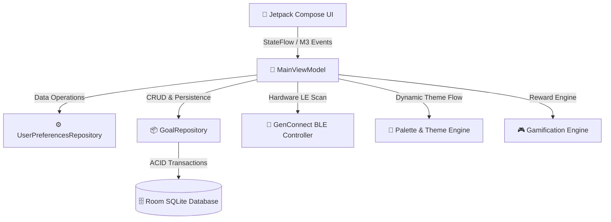

<!-- Animated Header Banner -->
<div align="center">
  

  <a href="https://github.com/gencode3939/Gen-Box">
    
  </a>
</div>

<p align="center">
  <a href="https://android.com"></a>
  <a href="https://kotlinlang.org"></a>
  <a href="https://developer.android.com/jetpack/compose"></a>
  <a href="https://developer.android.com/training/data-storage/room"></a>
  <a href="https://bluetooth.com"></a>
  <a href="https://github.com/gencode3939/Gen-Box"></a>
</p>

---

## 🌟 Overview

**Gen Box** is a state-of-the-art, **100% offline-first**, gamified financial goal tracker and digital vault built natively for Android. Designed with an unwavering commitment to user privacy, **Gen Box requires zero accounts, zero cloud servers, and collects zero telemetry.**

By turning routine saving habits into an engaging RPG-style progression system, Gen Box empowers users to achieve their milestones with interactive goal boxes, dynamic AI-powered theme customization, and an air-gapped peer-to-peer Bluetooth sharing protocol (**Gen Connect**).

---

## 🚀 Key Features

<div align="center">
  
</div>

### 📡 1. Gen Connect (Air-Gapped Bluetooth Transfer)
- **Direct Hardware BLE Discovery:** Scans and connects directly with nearby and paired Android devices via `BluetoothLeScanner` and `BluetoothAdapter` without relying on internet connections.
- **GTP2 Protocol Security:** Custom-designed transmission format featuring a 4-byte Magic Header (`GTP2`), 64-byte SHA-256 integrity verification, and AES-256-GCM encrypted payloads.
- **Ultra-Fast Sharing:** Transfer customized themes and box presets in milliseconds using 512-byte MTU optimization.

### 🎨 2. Reactive Dynamic Theming Engine
- **Instant Palette Morphing:** Seamlessly apply custom AI-extracted themes across the entire app with animated Material 3 `ColorScheme` transitions.
- **Preset & Custom Controls:** Quick-access theme chips (Calm Blue, Warm Coral, Night Glass, Mint Focus, Neutral Paper) with full override support for generated palettes.
- **Dark/Light & AMOLED Optimization:** Tailored contrast levels for both vibrant day-mode visibility and energy-efficient AMOLED black environments.

### 🎮 3. Gamification & Progression System
- **Gen Points (GP) Economy:** Earn points for financial discipline (+15 GP per deposit, +25 GP per new goal, +150 GP milestone jackpots).
- **Interactive Quests & Trophies:** Unlock achievements, level up your vault profile, and track savings streaks.
- **Reward Marketplace:** Redeem accumulated GP for custom 3D box models, neon glow shaders, and sound effects.

### 🌌 4. Quiet Galaxy & Gen Voice Assistant
- **Quiet Galaxy:** An interactive, meditative visual galaxy designed to foster mindfulness and stress-free financial planning.
- **Gen Voice Assistant:** Offline voice processing for rapid balance checks, deposit logging, and goal progress briefings.
- **Goal Orchestra:** Orchestrate multiple concurrent savings targets with automated milestone pacing.

### 🔒 5. Privacy-First Architecture
- **Zero-Cloud Guarantee:** All records, transactions, and audit logs are stored locally in an ACID-compliant Room SQLite database.
- **Privacy Shield:** Quickly conceal financial numbers (`••••••`) in public spaces with a single tap.
- **Audit & Export:** Full JSON backup and restore capabilities with automated validation.

---

## 🏛️ System Architecture



### Technology Stack

| Layer | Technologies | Purpose |
| :--- | :--- | :--- |
| **User Interface** | Jetpack Compose, Material Design 3 | Modern, declarative, fully reactive UI with smooth morphing transitions |
| **Architecture** | MVVM, Clean Architecture, Kotlin Coroutines & Flow | Unidirectional data flow, modular scalability, and robust state management |
| **Local Storage** | Room SQLite, DataStore Preferences | Zero-latency, structured, 100% on-device data persistence |
| **Hardware BLE** | Android Bluetooth Low Energy Framework | Direct device-to-device air-gapped theme transfer |
| **Cryptography** | AES-256-GCM, SHA-256 Digest | Complete integrity verification and cryptographic payload protection |

---

## 🛠️ Build & Installation

### Prerequisites
- **Android OS:** Android 8.0 (API Level 26) or newer (Android 14+ recommended)
- **IDE:** Android Studio Koala / Ladybug or newer
- **JDK:** Java 17+

### Getting Started

```bash
# 1. Clone the repository
git clone https://github.com/gencode3939/Gen-Box.git
cd Gen-Box

# 2. Build Debug APK
./gradlew assembleDebug

# 3. Install on connected device or emulator
./gradlew installDebug
```

---

## 📄 License

This project is licensed under the **MIT License** — see the [LICENSE](LICENSE) file for full details.

<!-- Animated Footer Wave -->
<p align="center">
  
</p>

<p align="center">
  <sub>Crafted with ❤️ by <a href="https://github.com/gencode3939"><b>@gencode3939</b></a> • Open Source & Privacy-First</sub>
</p>
